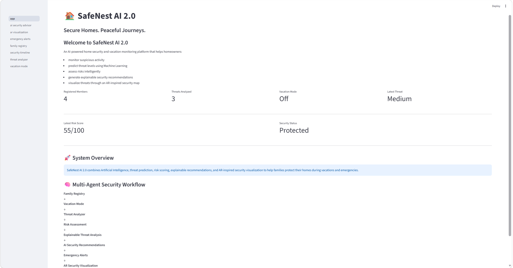
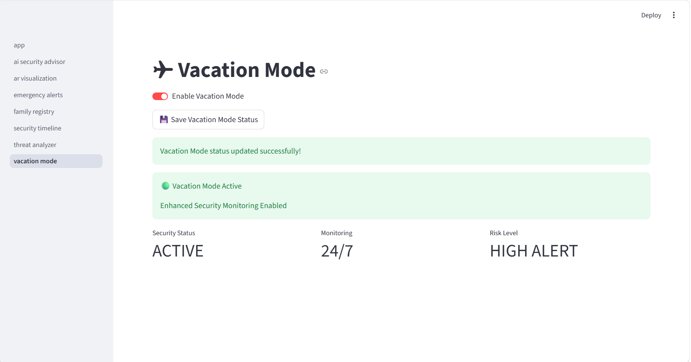
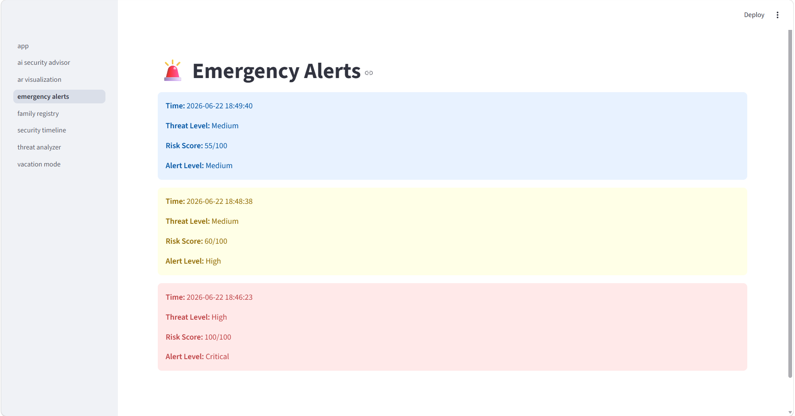

# 🏠 SafeNest AI 2.0  
## Secure Homes. Peaceful Journeys.

SafeNest AI 2.0 is an **AI-powered home security and vacation monitoring system** designed to help families protect their homes while they are away for vacations, business trips, festivals, or emergencies.

The system combines **Machine Learning-based threat prediction**, **risk scoring**, **AI-generated security recommendations**, **emergency alerting**, and an **AR-inspired security visualization dashboard** to provide intelligent and centralized home safety monitoring.

---

# 📌 Problem Statement

Families often worry about the safety of their homes while they are away.

Traditional home security systems mainly generate raw alerts such as door or motion notifications, but they often fail to provide:

- intelligent threat assessment
- centralized family safety management
- contextual risk scoring
- actionable recommendations
- clear visualization of where the threat is occurring inside the home

As a result, homeowners may receive alerts but still struggle to understand **how serious the situation is**, **which area is affected**, and **what action should be taken**.

---

# 💡 Solution

**SafeNest AI 2.0** addresses this problem by building an intelligent home monitoring platform that can:

- manage registered family members
- enable a dedicated **Vacation Mode** for enhanced monitoring
- analyze suspicious activities using **Machine Learning**
- predict threat severity (**Low / Medium / High**)
- calculate a contextual **risk score**
- generate **explainable threat reasons**
- provide **AI-based safety recommendations**
- maintain a **security timeline**
- display **emergency alerts**
- visualize threat-prone home zones through an **AR-inspired Security Map**

---

# 🚀 Key Features

## 👨‍👩‍👧 Family Registry
Register and manage authorized family members for the household security system.

## ✈ Vacation Mode
Enable enhanced monitoring when the homeowner is away. Vacation Mode increases sensitivity during threat analysis and helps simulate a real travel-security use case.

## 🚨 Threat Analyzer
Analyze suspicious incidents using user-selected security events such as:
- Motion Detection
- Door Activity
- Window Activity
- Known / Unknown Person
- Time of Incident
- Previous Security Incidents

## 🤖 AI Threat Prediction
Uses a **Random Forest Machine Learning model** to classify incidents into:
- **Low Threat**
- **Medium Threat**
- **High Threat**

## 📊 Risk Assessment Engine
Generates a **risk score (0–100)** based on:
- person type
- time of incident
- motion / door / window activity
- vacation mode status
- previous incidents

## 🧠 Explainable Threat Analysis
Provides human-readable reasons behind the threat decision, such as:
- unknown person detected
- night-time activity
- door / window activity
- repeated incident history
- vacation mode sensitivity

## 🛡 AI Security Recommendations
Generates actionable recommendations depending on the threat severity, such as:
- notify homeowner
- review CCTV / camera feed
- check doors and windows
- continue monitoring / log event

## 🚨 Emergency Alerts
Displays analyzed incidents as alert cards using severity-based prioritization.

## 📜 Security Timeline
Stores and displays past analyzed incidents with:
- timestamp
- person detected
- threat level
- risk score
- alert level

## 📱 AR Security Map
An **AR-inspired security visualization page** that maps the latest incident to different home zones such as:
- Front Door
- Window Zone
- Living Room / Motion Zone

## 🤖 AI Security Advisor
Summarizes the latest incident and shows:
- threat explanation
- alert level
- risk score
- recommended next steps

---

# 🏗 System Workflow / Architecture

SafeNest AI 2.0 follows the below workflow:

**Family Registry**  
↓  
**Vacation Mode Activation**  
↓  
**Threat Event Input**  
↓  
**Machine Learning Threat Prediction**  
↓  
**Risk Score Calculation**  
↓  
**Explainable Threat Analysis**  
↓  
**AI Security Recommendations**  
↓  
**Emergency Alerts**  
↓  
**Security Timeline Logging**  
↓  
**AR-Inspired Security Visualization**

---

# 🧠 Machine Learning Model

## Algorithm Used
- **Random Forest Classifier**

## Input Features
The model uses the following features during threat prediction:

- Person Type
- Time of Day
- Motion Detection
- Door Activity
- Window Activity
- Vacation Mode Status
- Previous Security Incidents

## Output Classes
- Low Threat
- Medium Threat
- High Threat

## Supporting AI Logic
In addition to ML prediction, SafeNest AI 2.0 also includes:
- custom **risk score calculation**
- **alert level classification**
- **explainability generation**
- **AI recommendation generation**

---

# 🖼 Project Screenshots

## 🏠 Dashboard


---

## 👨‍👩‍👧 Family Registry


---

## ✈ Vacation Mode


---

## 🚨 Threat Analyzer Result


---

## 🚨 Emergency Alerts


---

## 📱 AR Security Map


---

# 🛠 Tech Stack

## Frontend
- **Streamlit**

## Backend
- **Python**

## Machine Learning
- **Scikit-learn**
- **Random Forest Classifier**
- **Joblib**

## Data Handling
- **Pandas**
- **NumPy**

## Storage
- **JSON**

## Version Control
- **Git & GitHub**

---

# 📂 Project Structure

```bash
SafeNest_AI/
│
├── app.py
├── train_model.py
├── generate_dataset.py
├── threat_model.pkl
├── person_encoder.pkl
├── time_encoder.pkl
├── threat_encoder.pkl
├── requirements.txt
├── README.md
│
├── data/
│   ├── family.json
│   ├── vacation_mode.json
│   ├── stats.json
│   └── security_events.json
│
├── pages/
│   ├── family_registry.py
│   ├── vacation_mode.py
│   ├── threat_analyzer.py
│   ├── emergency_alerts.py
│   ├── security_timeline.py
│   ├── ar_visualization.py
│   └── ai_security_advisor.py
│
├── utils/
│   └── ai_agents.py
│
└── images/
    ├── dashboard_new.png
    ├── family_registry_image.png
    ├── vacation_mode_new.png
    ├── threat_analyzer_result.png
    ├── emergency_alerts_new.png
    ├── security_timeline_new.png
    ├── ar_security_map_new.png
    ├── ai_security_advisor.png
    └── safenest_homepage.png